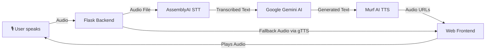

# AI Voice Agent : Liam

Liam is a **real-time voice-based conversational AI** that:
- Listens to your voice.
- Transcribes it into text using **AssemblyAI**.
- Generates a response using **Google Gemini AI**.
- Converts the AI's response into speech using **Murf AI** (with a gTTS fallback).

It’s designed for an **auto-loop conversation** where the bot and the user can talk continuously.

---

## 📂 Project Structure
```plaintext
project_root/
├── app.py               
├── config.py            
├── services/ 
│   ├── stt_service.py   
│   ├── tts_service.py   
│   └── llm_service.py   
├── utils/               
│   └── fallback.py
├── frontend/            
│   ├── index.html
│   ├── script.js
│   ├── styles.css
│   ├── speaker.png
│   └── fallback.mp3
├── uploads/             # Uploaded audio
├── generated_audio/     # Generated audio output
└── .env                

```

---

## 🛠 Technologies Used

**Frontend**
- HTML5, CSS3, JavaScript (Vanilla)
- Web Audio API & `MediaRecorder` API
- Lottie animations

**Backend**
- [Flask](https://flask.palletsprojects.com/) — Web framework
- [AssemblyAI](https://www.assemblyai.com/) — Speech-to-text
- [Google Gemini AI](https://ai.google.dev/) — Large Language Model
- [Murf AI](https://murf.ai/) — Text-to-speech
- [gTTS](https://pypi.org/project/gTTS/) — Fallback TTS

**Other**
- [python-dotenv](https://pypi.org/project/python-dotenv/) for environment variables
- `requests` for external API calls

---

## 🏗 Architecture


✨ Features

🎙 Continuous conversation loop (auto-listen after bot finishes speaking)

🔄 Session history tracking per conversation

🛡 Fallback voice if APIs fail (gTTS-generated)

📜 Chat history retrieval via /agent/history/<session_id>

💡 Minimalistic UI with Lottie animations and glowing mic button

⚡ Concurrent-safe chat storage with thread locking

🚀 Getting Started
1️⃣ Clone the repository
git clone https://github.com/vignesh-naik-720/Liam
cd Liam

2️⃣ Install dependencies
pip install -r requirements.txt


requirements.txt should include:

Flask
requests
python-dotenv
assemblyai
google-generativeai
gTTS

3️⃣ Set environment variables

Create a .env file in the root:
```
MURF_API_KEY=your_murf_api_key
ASSEMBLYAI_API_KEY=your_assemblyai_api_key
GEMINI_API_KEY=your_google_gemini_api_key
```

Get your API keys from:
```plaintext
Murf AI → https://murf.ai/

AssemblyAI → https://www.assemblyai.com/

Google Gemini → https://ai.google.dev/
```
4️⃣ Run the API server
python app.py


The Flask server runs at:

http://127.0.0.1:8000

5️⃣ Open the frontend

Open frontend/index.html in your browser
(or visit the Flask root / if serving static files via Flask).

📡 API Endpoints
```plaintext
Method	Endpoint	Description
POST	/agent/chat/<session_id>	Upload audio file, returns transcription, LLM output, and TTS audio URLs
GET	/agent/history/<session_id>	Retrieve conversation history
GET	/uploads/<filename>	Serve uploaded audio files
GET	/fallback.mp3	Serve fallback audio
```
⚠ Notes

Make sure microphone permissions are enabled in the browser.

If Murf AI fails, the system automatically falls back to gTTS.

Large text replies are chunked for TTS (max 3000 chars each).

The conversation context is capped at the last 20 messages per session.

👨‍💻 Author

Developed by Vignesh Naik
